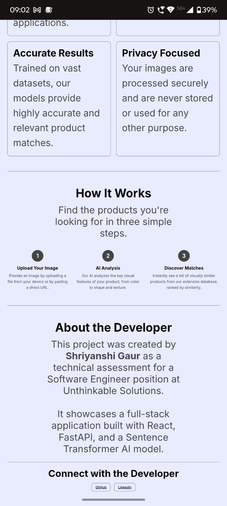

# Visual Product Matcher

*Live Application URL:* [https://visual-matcher-frontend.onrender.com](https://visual-matcher-frontend.onrender.com)

*Live Backend URL:* [https://shri012-visual-match-backend.hf.space](https://shri012-visual-match-backend.hf.space)

---

## 📝 Project Overview

This project is a full-stack web application built as a technical assessment for a Software Engineer position. It allows users to find visually similar products by uploading an image or providing an image URL. The application leverages a powerful AI model to analyze images and calculate similarity scores, providing an intuitive and responsive user experience.

---

## ✨ Key Features

* **Dual Image Input**: Supports both direct file uploads and searching via image URL.
* **Similarity Filtering**: Users can dynamically filter the search results based on a minimum similarity score to refine their search.
* **Real-time Previews**: Displays a preview of the selected image before the search is initiated.
* **Dynamic Results Grid**: Shows a clean, responsive grid of similar products found, including their name, category, and similarity match percentage.
* **Full-Stack Architecture**: Built with a modern, decoupled architecture using React for the frontend and FastAPI for the backend.
* **Enhanced UX**: Includes loading states during searches and clear error handling to provide a smooth user experience.

---

## 🖼️ Project Showcase

### Desktop View
| Main Interface | Search by Image Preview | Search by URL |
| :---: | :---: | :---: |
|  |  |  |

| Features & How It Works | About Section |
| :---: | :---: |
|  |  |

### Mobile View
| Mobile Home | Mobile Sections | Mobile Results |
| :---: | :---: | :---: |
|  |  |  |

---

## 🛠️ Tech Stack

### Frontend
* **React**: A component-based library for building interactive user interfaces.
* **CSS**: Custom CSS for styling, organized by component for maintainability.

### Backend
* **FastAPI (Python)**: A high-performance web framework for building APIs.
* **Uvicorn**: A lightning-fast ASGI server for running the FastAPI application.

### AI / Machine Learning
* **Sentence Transformers (`clip-ViT-B-32`)**: A state-of-the-art model for generating vector embeddings from images.
* **Scikit-learn**: Used for calculating the cosine similarity between image vectors.
* **NumPy**: For efficient numerical operations.

---

## 🚀 Getting Started

To run this project locally, you'll need Python 3.8+ and Node.js v16+ installed.

### Backend Setup

1.  **Navigate to the backend directory**:
    ```bash
    cd backend
    ```
2.  **Install Python dependencies**:
    ```bash
    pip install -r requirements.txt
    ```
3.  **Run the FastAPI server**:
    ```bash
    uvicorn main:app --reload
    ```
    The backend will now be running on `http://localhost:8000`.

### Frontend Setup

1.  **Open a new terminal** and navigate to the frontend directory:
    ```bash
    cd frontend
    ```
2.  **Install Node.js dependencies**:
    ```bash
    npm install
    ```
3.  **Run the React development server**:
    ```bash
    npm run dev
    ```
    The frontend will now be running on `http://localhost:5173`.
